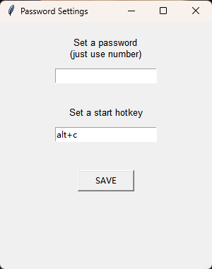
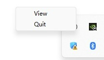
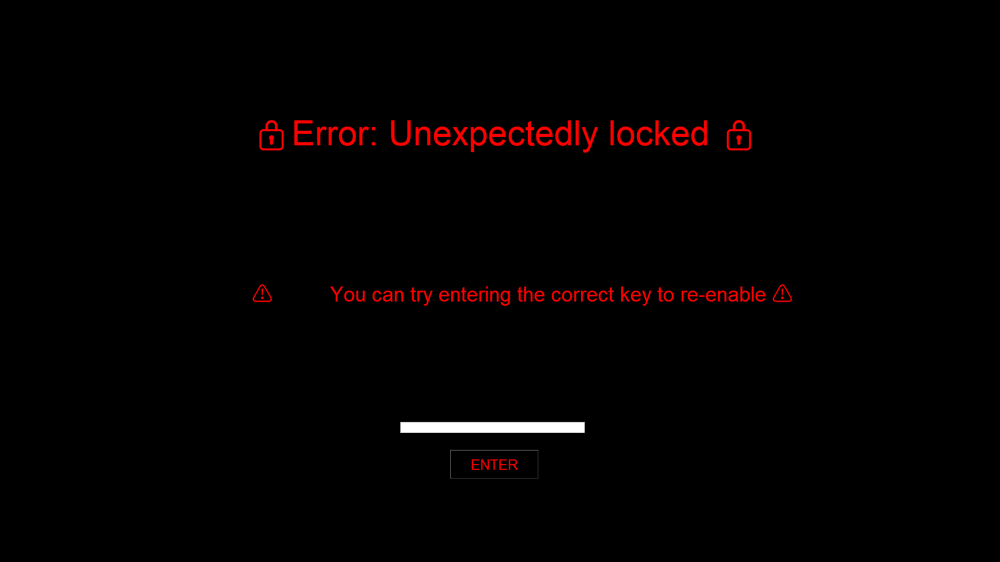
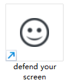

#   

  
  🌏 Language: English | <a href="./README_CN.md">中文</a>  

  
  
# 🔐 Defend Your Screen  
  
> A lightweight desktop access control tool that protects your screen without interrupting running tasks.  
  
---  
  
## 📖 Overview  
  
When stepping away from your computer, using the system lock is the usual choice — but it can sometimes interfere with what’s already running, especially in cases like remote sessions or long-running tasks.  
  
This project comes from a simple idea:  
  
> Cover the screen, without changing the system state.  
  
Instead of locking the system, it works more like an overlay-based lock — keeping everything running while blocking interaction.  
  
---  
  
## 🧠 Key Concept  
  
> 🔒 Restrict access without disrupting execution  
  
Instead of pausing or terminating anything, this tool:  
  
- Uses a full-screen overlay to block interaction    
- Keeps all applications running as-is    
- Allows quick unlock via password    
  
---  
  
## ⚙️ Features  
  
- 🔐 Password-protected unlock    
- ⚡ Instant lock when activity is detected    
- ⌨️ Global hotkey to enable monitoring mode    
- 🖥 System tray integration (settings / exit)    
- 🔁 Repeatable workflow (activate → lock → unlock)    
- 🧩 Lightweight (~9MB memory, near 0% CPU when idle)    
- 🛠 Built with Python, easy to modify    
  
---  
  
## 👀 Screenshots  
  
### 1.Settings Panel  
  

  
    

  
  
### 2.System Tray Menu  
  

  
    

  
  
### 3.Lock Screen  
  

  
    

  
  
### 4.App Icon  
  

  
    

  
  
---  
  
## 🚀 Workflow  
  
1. Launch the application    
2. Set password and hotkey    
3. Activate monitoring mode    
4. When input is detected:  
   - Screen locks instantly    
   - Interaction is blocked    
5. Enter password to unlock    
6. Continue as needed    
  
---  
  
## 📦 Installation  
  
Download the latest release from GitHub.  
  
Make sure the following files are in the same directory:  
defend your screen.exe  
defend your screen.png  
  
Then run the executable.  
  
---  
  
## 🧭 Usage  
  
### 1. Setup  
  
- Set password in **Set a password**    
- Set hotkey in **Set a start hotkey**    
- Click **Save**    
  
> ⚠️ If password is empty, pressing Enter will unlock immediately    
  
---  
  
### 2. Activate Monitoring Mode  
  
- Press the hotkey (default: `Alt + C`)    
- A system sound indicates activation    
  
---  
  
### 3. Lock & Unlock  
  
- Any input triggers lock    
- Enter password and press **Enter** to unlock    
  
---  
  
### 4. System Tray  
  
Right-click tray icon:  
  
- **View** → Open settings    
- **Quit** → Exit    
  
---  
  
## 🧩 Tech Stack  
  
- Python    
- tkinter    
- pystray    
- keyboard    
  
---  
  
## 📄 License  
  
MIT License  
  
---  
  
## 📄 Note  
  
This tool is not a replacement for system lock.  
  
It’s designed for convenience in specific scenarios where interrupting the current session is not desirable.  
